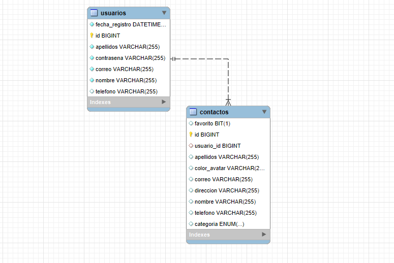
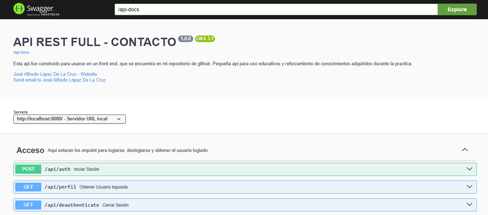
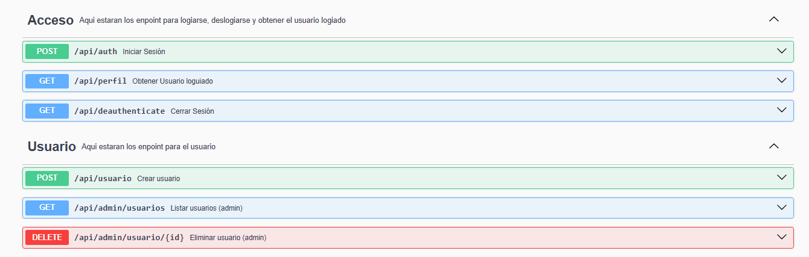
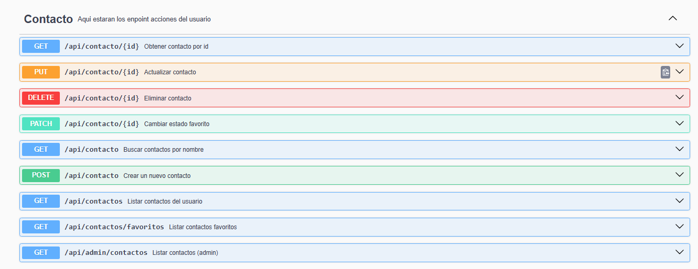
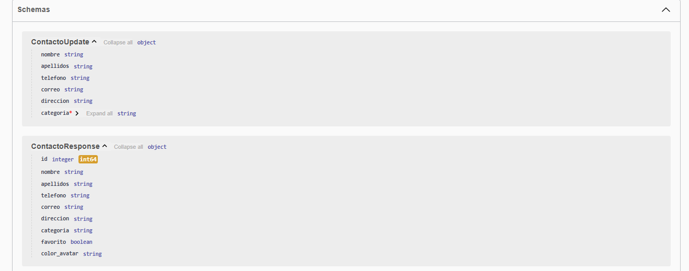
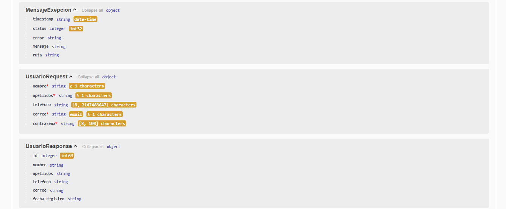
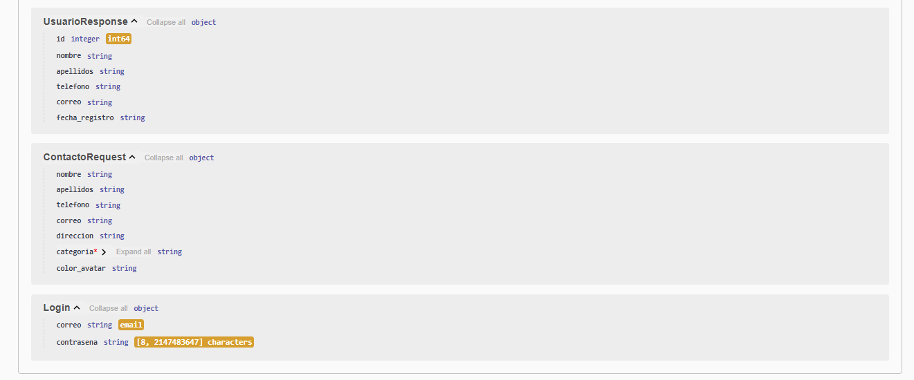

# API-CONTACTO

Esta apirest full fue hecha para poder usarse en frontend <a href="https://github.com/AlfreGood20/PWA-AGENDA-DE-CONTACTO">REPOSITORIO</a>. Hechas con buena practicas de programacion web backend. Consiste en un CRUD de contactos con usuarios con relacion a contactos, asi como la utilizacion de httpSession para el manejo de sesion.

## Caracteristicas
- Autenticacion (httpSession)
- CRUD de contactos
- Busqueda de elementos y filtraccion
- Manejo de errores consistentes (MensajeExepcion)
- Documentacion OpenAPI (Swagger)
- Buenas Practicas

## Diagrama Relacional DB


## Instalación
Requisitos: Java 17+, maven

Base De Datos: Mysql 8+

1. Clonar:
```bash
git clone https://github.com/AlfreGood20/API-AGENDA-CONTACTOS.git

cd api-contacto
````
2. Compilar:
```powershell
mvn clean package -DskipTests
```

## Ejecución (Windows)
Ejecuta la API localmente:
```powershell
mvn spring-boot:run
# o
java -jar target/api-contacto-0.0.1-SNAPSHOT.jar
```
Accede a: http://localhost:8080

## Configuración / Variables de entorno
Variables necesarias (application.properties/example .env):
- DB_URL
- DB_USERNAME
- DB_PASSWORD

Ejemplo:
```properties
# .env.example
SPRING_DATASOURCE_URL=jdbc:mysql://localhost:3306/api_contacto
SPRING_DATASOURCE_USERNAME=root
SPRING_DATASOURCE_PASSWORD=secret
```

## Documentación de la API
- OpenAPI/Swagger UI: http://localhost:8080/api-documentacion (Siempre cuando este corriendo la api)
- Archivo OpenAPI generado: /v3/api-docs

## Documentación visual







## Esquemas




